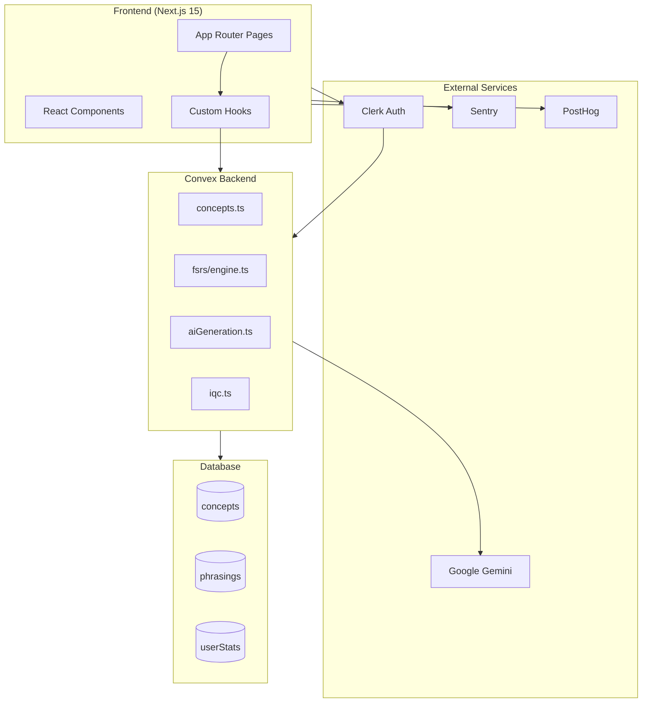

# Codebase Map

> Auto-generated by Cartographer. Last mapped: 2026-01-26

## System Overview

Scry is an AI-powered spaced repetition learning application built with Next.js 15 and Convex. It uses Google Gemini for intelligent concept generation and implements the FSRS (Free Spaced Repetition Scheduler) algorithm for scientifically optimized learning intervals.

The philosophy is "Pure FSRS" - no daily limits, no comfort features, no artificial interleaving. If 300 cards are due, you see 300 cards. Natural consequences teach sustainable habits.

## Architecture



## Directory Structure

```text
scry/
├── app/                    # Next.js App Router
│   ├── (authenticated)/    # Protected routes
│   ├── api/                # API routes (health, webhooks)
│   └── layout.tsx          # Root layout with providers
├── components/
│   ├── providers/          # Context providers (PostHog, Clerk)
│   ├── ui/                 # shadcn/ui components
│   └── *.tsx               # Feature components
├── convex/
│   ├── fsrs/               # FSRS algorithm
│   ├── lib/                # Backend utilities
│   └── *.ts                # Domain modules
├── hooks/                  # Custom React hooks
├── lib/                    # Frontend utilities
├── docs/                   # Documentation
├── scripts/                # Deployment scripts
└── tests/                  # Test suites
```

## Module Guide

### Backend (convex/)

| File | Purpose |
|------|---------|
| `schema.ts` | Database schema (concepts, phrasings, interactions, userStats) |
| `concepts.ts` | Concept CRUD + FSRS integration |
| `aiGeneration.ts` | AI generation pipeline |
| `generationJobs.ts` | Job lifecycle management |
| `embeddings.ts` | Vector embeddings (768-dim) |
| `iqc.ts` | Intelligent Quality Control (duplicate detection) |
| `fsrs/engine.ts` | Pure FSRS implementation |
| `lib/userStatsHelpers.ts` | O(1) incremental stat updates |

### Frontend (app/, components/, hooks/)

| File | Purpose |
|------|---------|
| `app/layout.tsx` | Root layout with provider stack |
| `components/review-flow.tsx` | Main review session interface |
| `components/generation-modal.tsx` | AI generation input |
| `hooks/use-review-flow.ts` | Review state machine |
| `hooks/use-unified-edit.ts` | Concept+phrasing editing |
| `lib/sentry.ts` | Sentry config with PII scrubbing |
| `lib/logger.ts` | Pino structured logging |

## Key Conventions

### Backend-First Workflow
1. Implement mutation/query in `convex/`
2. Wait for "Convex functions ready!"
3. Then import in frontend

### Mutation Pairs
- Archive ↔ Unarchive
- SoftDelete ↔ Restore
- HardDelete (irreversible)

### Confirmation UX
- Reversible → `useUndoableAction()` with toast
- Irreversible → `useConfirmation()` with typing

### Keyboard Shortcuts
- `g` - Generation modal
- `1-4` - Select answer
- `e` - Edit question
- `a` - Archive concept

## Gotchas

1. **Never `source .env.production`** - Use `export KEY=$(grep KEY .env.production | cut -d= -f2)`
2. **TypeScript property checks fail at runtime** - Use `'field' in (doc as any)` for migrations
3. **Separate dev/prod Convex** - Dev: `amicable-lobster-935`, Prod: `uncommon-axolotl-639`
4. **Always `.take(limit)`** on queries (bandwidth optimization)
5. **PostHog via proxy** - `/ingest/*` routes avoid ad blockers

## Navigation Guide

**Add Convex mutation:** `convex/[domain].ts` → wait for ready → import `api.[domain].[mutation]`

**Add page:** `app/[route]/page.tsx` (use `(authenticated)` group if protected)

**Add migration:** `convex/migrations/` → test with `./scripts/run-migration.sh [name] dev`

**Modify FSRS:** `convex/fsrs/engine.ts` (algorithm), `conceptScheduler.ts` (scheduling)
